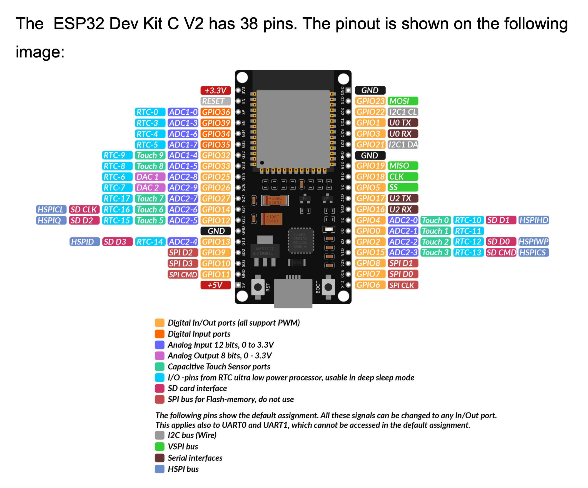

# esp32

This is a simple repository to store code for the ESP32 micro controller

> TIP: The ESP32 is a powerful microcontroller that can be used for many different projects. It has built in WiFi and Bluetooth capabilities, making it ideal for IoT projects. This repository will contain code examples and projects that can be used with the ESP32.
>
> The esp32 that I am using is the ESP32 DevKitC V2. Make sure to check the version of your board before running the code.

## Getting Started

- To get started with the ESP32, you will need to install the Arduino IDE and the ESP32 board support package. You can find instructions on how to do this on the [Random Nerd Tutorials website](https://randomnerdtutorials.com/getting-started-with-esp32/)

- To check out the projects in this repository, go to the `projects` folder and open the project in the Arduino IDE. You can then upload the code to the ESP32 and see the results.

## Upload code to ESP32

- To upload code to the ESP32, you will need to connect the board to your computer using a USB cable. Then, open the Arduino IDE and select the correct board and port in the `Tools` menu. Finally, click the upload button to upload the code to the board.

## ESP32 DevKitC V2 Pin Map

## License

- [MIT](LICENSE.md)
